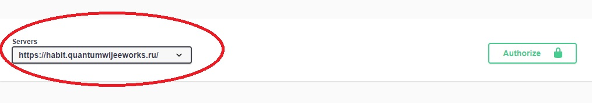
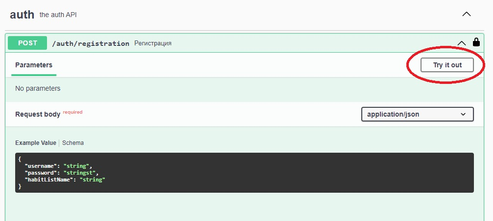
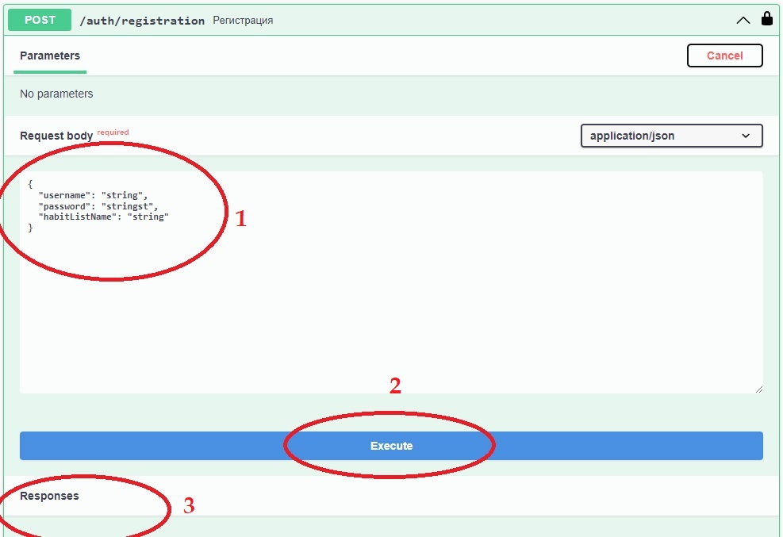
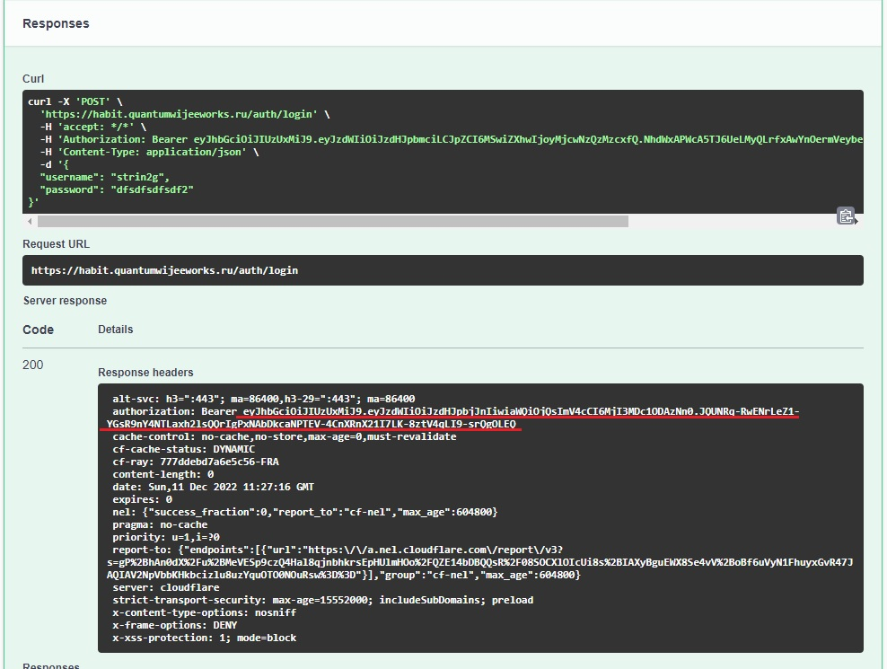
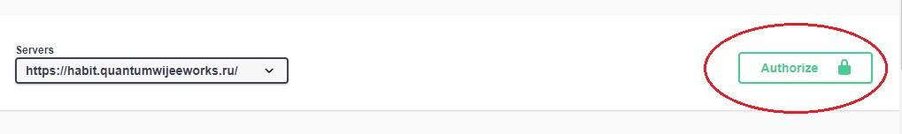
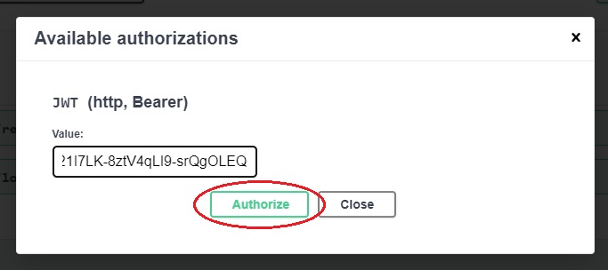

# Habit Tracker

## Задачи

1. Создать базовую архитектуру приложения. Реализовать сущности и репозиторий для CRUD операций
   1. UserEntity
   2. Habit
   3. HabitList
2. Добавить авторизацию/аутентификацию/регистрацию (spring security)
3. Реализовать api для взаимодействия с системой + добавить swagger
4. Клиент
5. Деплой


## Как использовать Swagger?

1) Переходим по ссылке: https://habit.quantumwijeeworks.ru/swagger-ui/index.html
2) Надо убедится, что в поле servers выбран наш сервер



3) Регистрируемся

Находим запрос на регистрацию. Раскрываем его. Нажимаем на кнопку "Try it out"



- Заполняем тело запроса
- Нажимаем на кнопку "Execute"
- Смотрим, что пришел ответ с кодом 200



4) Входим в систему

Все делаем аналогично предыдущему шагу. После выполнения запроса копируем JWT.



Нажимаем на кнопку "Authorize".



В открывшемся окне есть одно текстовое поле. В него вставляем наш JWT, который мы 
ранее скопировали. Жмем на кнопку "Authorize"



Все, swagger готов к работе.

## Конфигурация приложения

### Путь к базе данных

Пример:
```properties
spring.datasource.url=jdbc:postgresql://localhost/habit_tracker
```

### Логин и пароль для базы данных

Пример:
```properties
spring.datasource.username=login
spring.datasource.password=password
```

### Описание стратегии работы с бд при перезапуске приложения

```properties
spring.jpa.generate-ddl=true
spring.jpa.hibernate.ddl-auto=update
```

### Секрет JWT

```properties
app.jwt.secret=veryverybigsecretveryverybigsecretveryverybigsecretveryverybigsecretveryverybigsecretveryverybigsecret
```

### Время жизни токена JWT

```properties
app.jwt.expire=600000000000
```

## PMD

Как запустить PMD?
1) Идем в Edit configurations...
2) Добавить новую Maven конфигурацию
3) В поле Run пишем "pmd:pmd"
4) При запуске этой конфигурации получаем отчет. Его можно найти по пути **/target/site/pmd.html
